<div align="center">

### External Footprinting • Passive Reconnaissance • Network Scanning • Evidence-Based Security Analysis

<p>


</p>

</div>

------------------------------------------------------------------------

## 📌 What This Week Was About

Week 2 moved the cybersecurity laboratory from the controlled
environment built in Week 1 into an authorized external assessment
workflow against `networkwalks.com`.

The work was organized as a sequence of project modules rather than a
single large scan. Each module answers a different reconnaissance
question:

``` text
What is the target?
       ↓
What public infrastructure is associated with it?
       ↓
What technologies and metadata are externally visible?
       ↓
What historical names and certificates exist?
       ↓
What network services respond?
       ↓
Which service identities can actually be validated?
       ↓
How do independent tools corroborate one another?
       ↓
What should be validated next?
```

The goal was not to turn every interesting response into a
vulnerability. The assessment deliberately separates:

-   **Observed facts**
-   **Tool-generated candidates**
-   **Historical intelligence**
-   **Shared-provider infrastructure**
-   **Unresolved service identities**
-   **Confirmed security findings**
-   **Non-findings / tests not performed**

That distinction is one of the main lessons of this week's work.

------------------------------------------------------------------------

# 🎯 Week 2 Objectives

The Week 2 objectives were to:

-   Build an external footprint of `networkwalks.com`.
-   Validate DNS information through more than one method.
-   Fingerprint the public web stack.
-   Identify defensive infrastructure such as a WAF.
-   Understand search-engine/GHDB footprinting.
-   Understand relationship-based footprinting through Maltego.
-   Perform passive Certificate Transparency reconnaissance.
-   Reconstruct historical certificate-derived hostnames.
-   Correlate passive subdomain results from independent sources.
-   Enumerate the network-facing TCP surface with Nmap.
-   Validate service identities with version detection and NSE.
-   Inspect HTTP, HTTPS, hosting-management, mail and TLS surfaces.
-   Attempt OS fingerprinting while preserving uncertainty.
-   Use Zenmap as the graphical Nmap workflow.
-   Preserve screenshots, commands and raw outputs.
-   Build a reusable Week 2 evidence package for later reporting.

------------------------------------------------------------------------

# 🛡️ Authorization & Ethical Boundary

This work was performed in the context of an **authorized Networkwalks
cybersecurity internship assessment**.

The techniques in this repository must only be used against systems
where the tester has explicit authorization.

``` text
Written authorization
        ↓
Defined target / scope
        ↓
Reconnaissance
        ↓
Controlled enumeration
        ↓
Evidence preservation
        ↓
Validation
        ↓
Responsible reporting
```

No credential compromise, persistence, destructive testing or
unauthorized access is claimed in this repository.

------------------------------------------------------------------------

# 🧭 Assessment Scope

  Item                   Value
  ---------------------- -----------------------------------------------
  Target                 `networkwalks.com`
  Observed IPv4          `192.232.216.135`
  Reverse DNS observed   `192-232-216-135.unifiedlayer.com`
  Assessment context     Authorized Networkwalks internship assessment
  Primary OS             Kali Linux
  Assessment window      September 2026
  Primary focus          Reconnaissance and network enumeration
  Exploitation           Not performed / not claimed
  Credential testing     Not performed / not claimed
  Brute force            Not performed / not claimed
  Takeover testing       Not performed / not claimed
  Destructive activity   Not performed / not claimed

------------------------------------------------------------------------

# 🧰 Tools Used Across Week 2

The Week 2 workflow combined command-line reconnaissance, passive OSINT,
network enumeration and graphical Nmap analysis. Each tool served a
different evidence-collection purpose.

| Tool | Primary use in this assessment |
|---|---|
| **Kali Linux** | Assessment operating environment and security toolkit |
| **WHOIS** | Domain registration and nameserver context |
| **nslookup** | DNS record resolution and resolver comparison |
| **dig** | Direct DNS and authoritative-server validation |
| **DNSRecon** | Automated DNS enumeration and timeout behavior validation |
| **WhatWeb** | Web technology and application fingerprinting |
| **cURL** | HTTP/HTTPS response, headers and cookie inspection |
| **WAFW00F** | Web Application Firewall fingerprinting |
| **SpiderFoot** | Automated passive OSINT collection and evidence preservation |
| **theHarvester** | Passive host and certificate-source reconnaissance |
| **CertSpotter** | Certificate Transparency source within passive reconnaissance |
| **crt.sh** | Direct Certificate Transparency record collection |
| **Subfinder** | Passive subdomain/hostname discovery and cross-source correlation |
| **Nmap** | TCP discovery, service/version detection, NSE, TLS and OS fingerprinting |
| **Zenmap** | Graphical interface for configuring, executing and reviewing Nmap scans |
| **jq** | Structured parsing and normalization of certificate JSON data |

The supplied GHDB and Maltego material was also reviewed as part of the
Week 2 methodology, while conclusions in this README are based on the
execution evidence actually preserved in the repository.

---

# 🗺️ Week 2 Architecture

``` text
                             networkwalks.com
                                     │
                                     ▼
                         ┌──────────────────────┐
                         │  External Footprint  │
                         └──────────┬───────────┘
                                    │
              ┌─────────────────────┼─────────────────────┐
              │                     │                     │
              ▼                     ▼                     ▼
            PM1                   PM2                   PM3
      Multiple Kali tools       GHDB/search            Maltego
              │                     │                     │
              └─────────────────────┼─────────────────────┘
                                    │
                                    ▼
                                  PM4
                         Passive certificate /
                         hostname intelligence
                                    │
                                    ▼
                                  PM5
                         Nmap + Zenmap scanning
                                    │
                                    ▼
                         Cross-source correlation
                                    │
                                    ▼
                         Week 2 final assessment
```

------------------------------------------------------------------------

# 📚 Project Module Structure

The supplied Week 2 project brief identifies the footprinting modules
and the essential scanning/final-report components.

``` text
WEEK 02
│
├── Elective / Reconnaissance Modules
│   │
│   ├── W2-PM1
│   │   Footprinting with multiple Kali tools
│   │
│   ├── W2-PM2
│   │   GHDB-based Footprinting Attacks
│   │
│   ├── W2-PM3
│   │   Maltego-based Footprinting Attacks
│   │
│   └── W2-PM4
│       theHarvester-based Footprinting Attacks
│
├── Essential Module
│   │
│   └── W2-PMB
│       Zenmap-based Network Scanning
│
└── Essential Deliverable
    │
    └── W2-PM-FINAL
        Detailed report covering selected modules
```

> **Repository note:** PM1, PM4, Nmap and Zenmap execution evidence is
> consolidated in this repository. PM2 and PM3 are documented according
> to the supplied module material without inventing results that were not
> captured.

------------------------------------------------------------------------

# 1️⃣ W2-PM1 --- Footprinting with Multiple Kali Tools

## Objective

The first module established a baseline external footprint using
multiple reconnaissance utilities.

### PM1 workflow

``` text
networkwalks.com
│
├── WHOIS
│   └── Registration / registrar context
│
├── nslookup
│   ├── A
│   ├── NS
│   ├── MX
│   ├── TXT
│   └── SOA
│
├── DNSRecon
│   └── Automated DNS enumeration
│       └── Timeout behavior recorded
│
├── dig
│   └── Authoritative validation
│
├── WhatWeb
│   └── Web technology fingerprinting
│
├── cURL
│   └── HTTP header / cookie inspection
│
├── WAFW00F
│   └── WAF fingerprinting
│
└── SpiderFoot
    └── Automated OSINT / passive reconnaissance workflow
```

## Target resolution

### 📸 Proof --- DNS Resolution & Validation

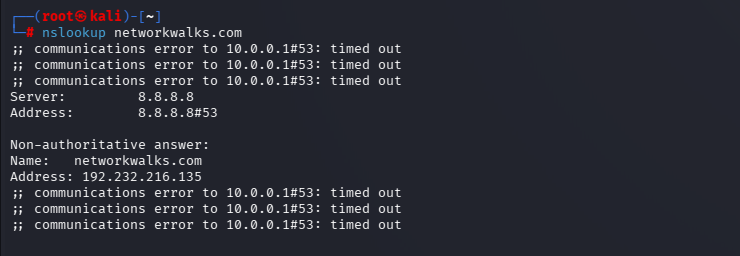

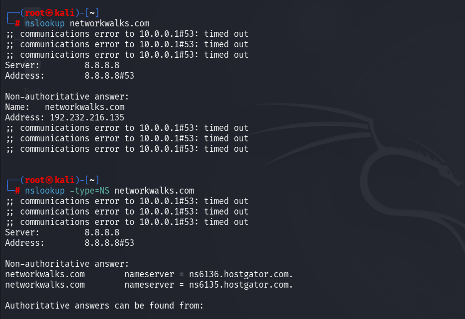

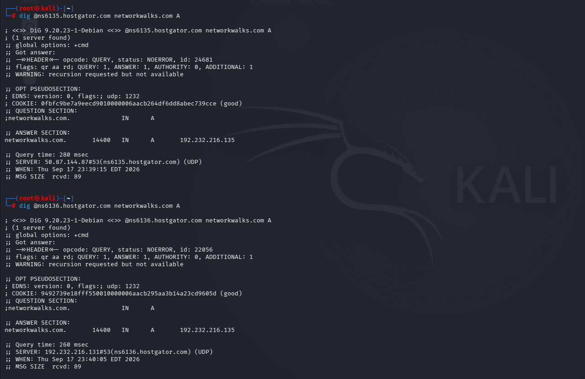

The public DNS path resolved:

``` text
networkwalks.com
        │
        ▼
192.232.216.135
```

The local resolver at `10.0.0.1` repeatedly timed out during some
queries, while `8.8.8.8` returned successful answers.

The correct interpretation was therefore not "the target's DNS is down",
but:

``` text
Local resolver timeout
        ↓
Try explicit public resolver
        ↓
Successful answer
        ↓
Validate against authoritative nameserver
```

## DNS infrastructure

### 📸 Proof --- DNS Records & Authoritative Validation

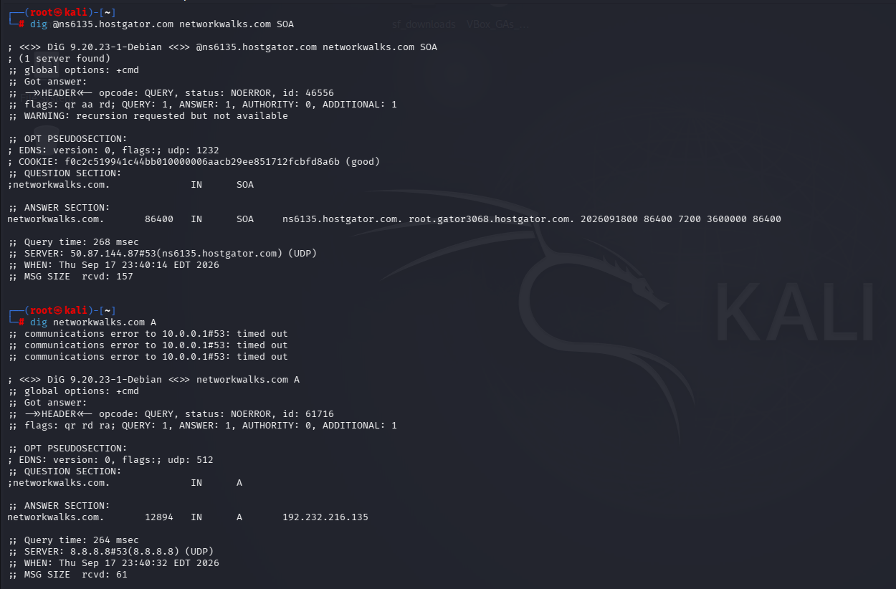

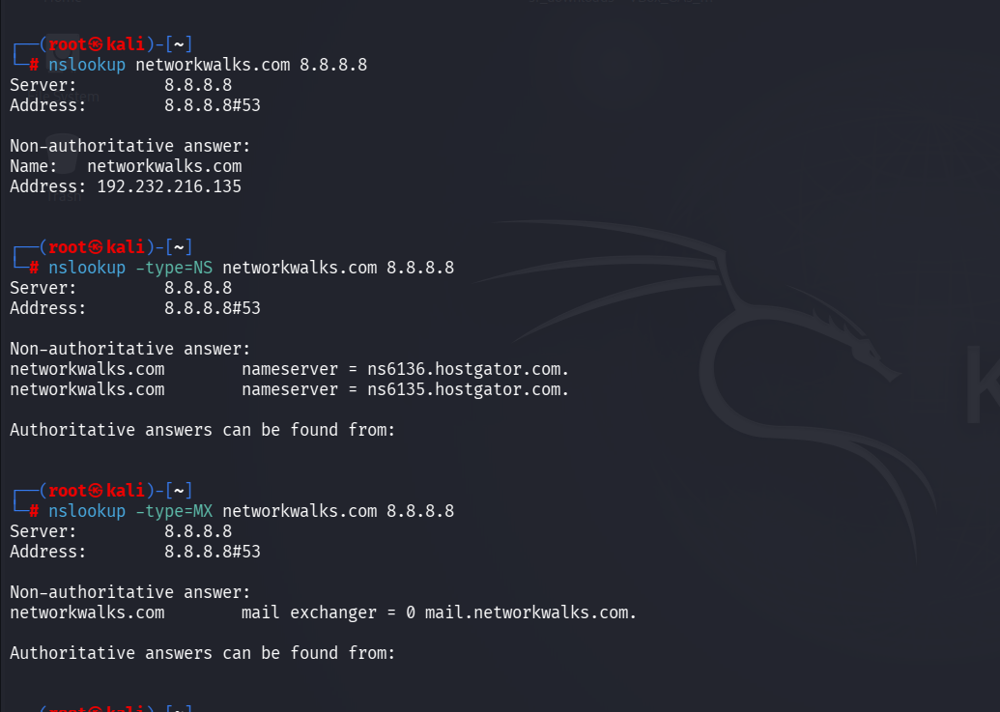

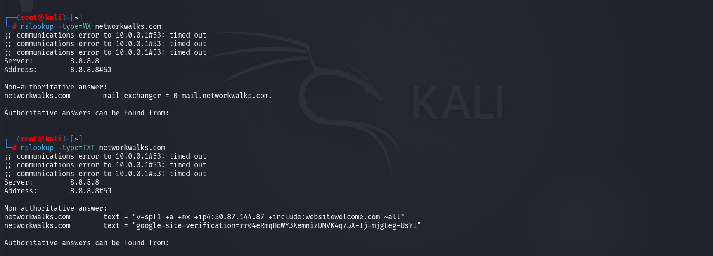

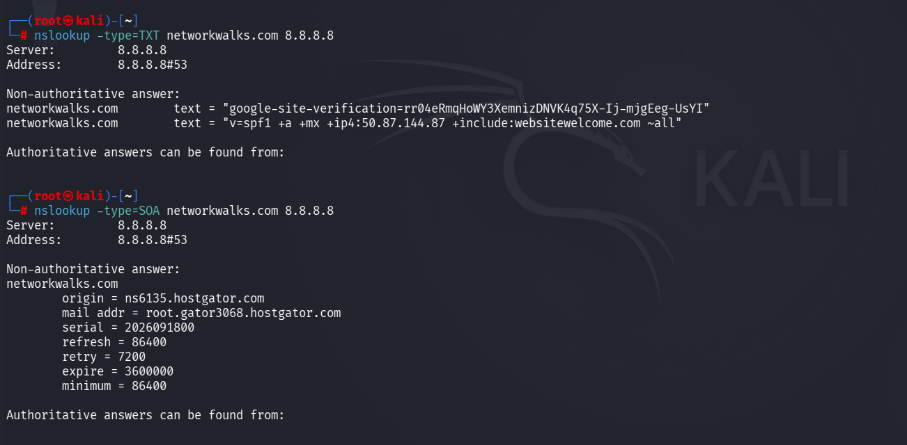

Observed nameservers:

``` text
ns6135.hostgator.com
ns6136.hostgator.com
```

Observed MX:

``` text
mail.networkwalks.com
```

TXT information included SPF and a Google site-verification token.

The SOA record was independently queried directly against
`ns6135.hostgator.com`.

## Web fingerprint

### 📸 Proof --- WhatWeb Fingerprinting

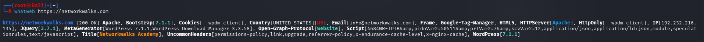

WhatWeb returned an HTTP 200 response and identified technologies
including:

-   Apache
-   WordPress
-   WordPress Download Manager
-   jQuery 3.7.1
-   Google Tag Manager
-   HTML5
-   WordPress-related metadata

Version fingerprints should be independently validated before being used
for CVE attribution.

## HTTP metadata

### 📸 Proof --- HTTP Header Inspection

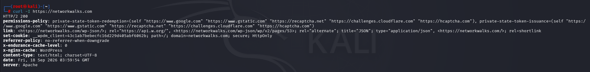


cURL exposed:

-   HTTP/2 200
-   WordPress REST API `Link` headers
-   `__wpdm_client` cookie
-   Secure / HttpOnly cookie attributes
-   cache-related headers
-   referrer policy

These are attack-surface observations, not proof of an exploitable
WordPress/API vulnerability.

## WAF

### 📸 Proof --- WAFW00F Detection

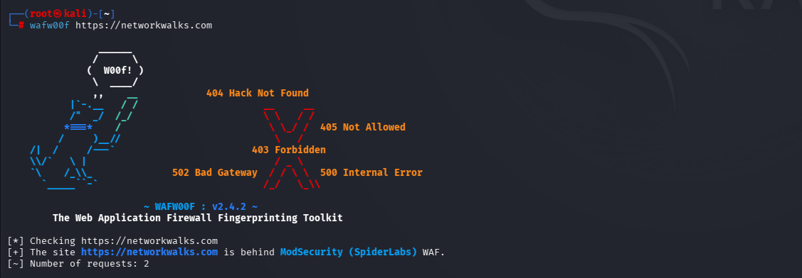

WAFW00F fingerprinted:

``` text
ModSecurity (SpiderLabs) WAF
```

This establishes a defensive technology fingerprint. No WAF bypass
testing was performed.

## SpiderFoot — Automated OSINT Support

SpiderFoot was also used as part of the reconnaissance toolkit to
organize and automate passive intelligence collection around the target.
It complements the command-line workflow by providing a broader OSINT
collection and correlation layer across domains, DNS, certificates,
network infrastructure and other public sources.

### Tool baseline

``` text
SpiderFoot
Version: 4.0.0
Path: /usr/share/spiderfoot/sf.py
Binary: /usr/bin/spiderfoot
```

### 📸 Proof — SpiderFoot Passive-Reconnaissance Workspace

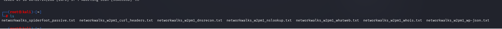

The preserved PM1 evidence shows the SpiderFoot passive-reconnaissance
output artifact saved as `networkwalks_spiderfoot_passive.txt`. This
provides evidence that SpiderFoot was incorporated into the reconnaissance
workflow and that its output was preserved for later analysis.

The SpiderFoot evidence is retained as part of the Week 2 reconnaissance
work. Its role in this assessment is intelligence collection and
correlation; individual SpiderFoot observations are treated as leads that
should be validated with independent sources before being promoted to
confirmed findings.

### Reproducibility

``` bash
which spiderfoot
spiderfoot --version
python3 /usr/share/spiderfoot/sf.py -h
```

## PM1 conclusion

### 📸 Proof --- PM1 Evidence Preservation & WHOIS


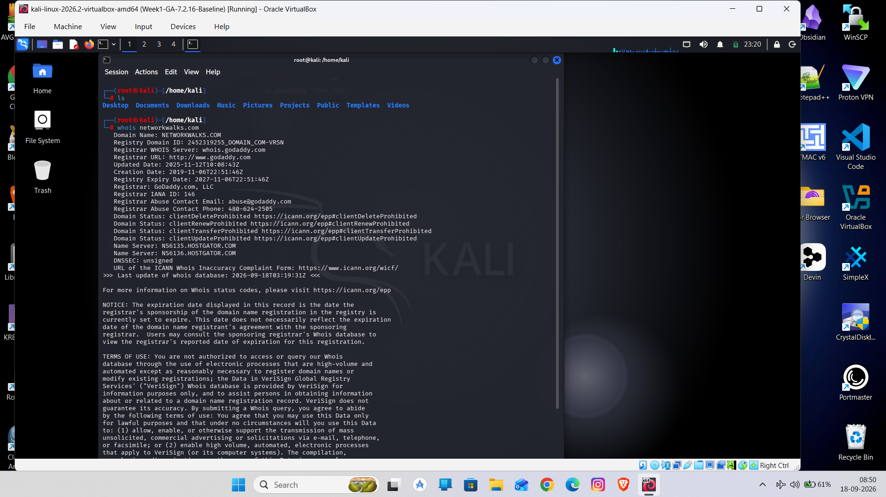

PM1 established the first external picture:

``` text
Domain
  ↓
DNS
  ↓
IP
  ↓
Web stack
  ↓
HTTP metadata
  ↓
WAF
```

------------------------------------------------------------------------

# 2️⃣ W2-PM2 --- GHDB-Based Footprinting Attacks

## Objective

The supplied Networkwalks PM2 training material introduces the Google
Hacking Database as a search-engine footprinting technique.

The supplied exercise contains two main tasks:

``` text
Task 1
Find indexed exposed security-camera links
        │
        ▼
GHDB search operators / dorks

Task 2
Find indexed mathematics PDF listings
        │
        ▼
Directory / file-index search patterns
```

The training material demonstrates that search engines can expose
accidentally indexed resources.

## Correct analytical model

``` text
GHDB dork
   ↓
Search engine
   ↓
Indexed result
   ↓
Candidate URL
   ↓
Current reachability
   ↓
Ownership / authorization
   ↓
Security significance
```

An indexed result alone is not sufficient to claim current exposure or a
vulnerability.


------------------------------------------------------------------------

# 3️⃣ W2-PM3 --- Maltego-Based Footprinting Attacks

## Objective

PM3 is the relationship-analysis component of the Week 2 footprinting
work.

The intended model is:

``` text
Seed domain
    │
    ▼
Maltego
    │
    ├── Domain entities
    ├── DNS entities
    ├── IP entities
    ├── Certificate entities
    ├── Host entities
    └── Related infrastructure
             │
             ▼
        Transforms
             │
             ▼
      Relationship graph
             │
             ▼
       Analyst validation
```


### PM3 evidence placeholder

``` text
PM3 — MALTEGO EVIDENCE
│
├── [ ] Maltego installation / version
├── [ ] Seed entity
├── [ ] Transform configuration
├── [ ] Discovered entities
├── [ ] Relationship graph
├── [ ] Validation
└── [ ] Findings
```

------------------------------------------------------------------------

# 4️⃣ W2-PM4 --- Passive Reconnaissance & Certificate Intelligence

## Objective

PM4 moved the assessment into passive intelligence collection using
certificate logs and passive subdomain discovery.

### Workflow

``` text
networkwalks.com
│
├── theHarvester 4.10.1
│   ├── CertSpotter
│   └── crt.sh adapter
│
├── Direct crt.sh
│   ├── Raw certificate records
│   ├── Name normalization
│   └── Historical timeline
│
└── Subfinder v2.16.0
    └── Passive hostname discovery
```

## Tool baseline

### 📸 Proof --- PM4 Tool Baseline

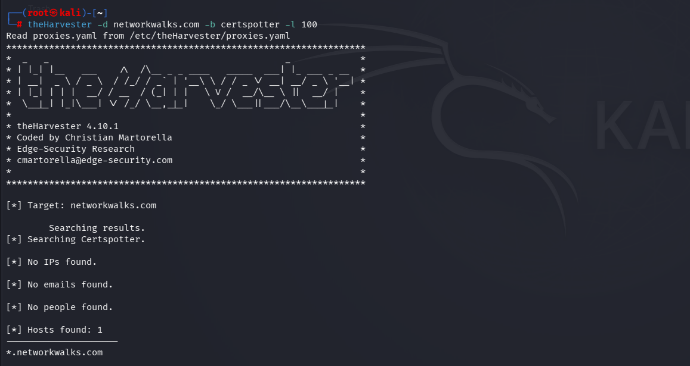

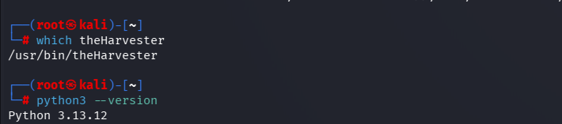

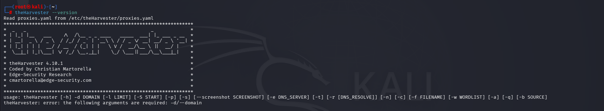

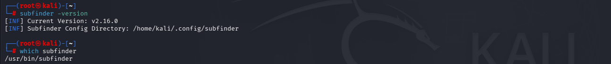

``` text
theHarvester 4.10.1
/usr/bin/theHarvester

Python 3.13.12

Subfinder v2.16.0
/usr/bin/subfinder
```

## CertSpotter

### 📸 Proof --- CertSpotter


TheHarvester's CertSpotter source returned:

``` text
*.networkwalks.com
```

This is treated as wildcard certificate namespace information.

It does not establish that an arbitrary wildcard-covered hostname is
currently live.

## crt.sh adapter

### 📸 Proof --- crt.sh Adapter

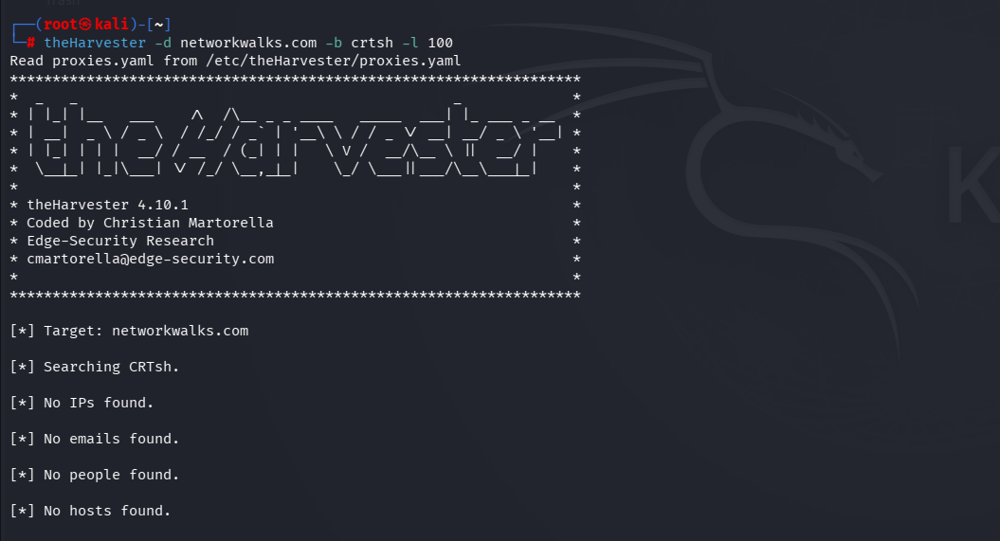

TheHarvester's crt.sh adapter returned no hosts in that particular
invocation.

This was treated as a **source-adapter result**, not as proof that the
global certificate log contained no records.

## Direct Certificate Transparency validation

### 📸 Proof --- Direct Certificate Transparency Collection

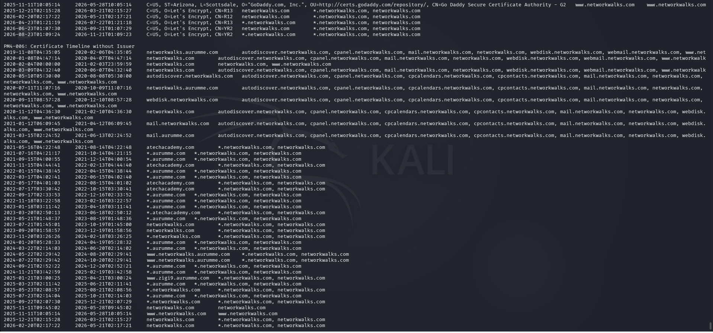

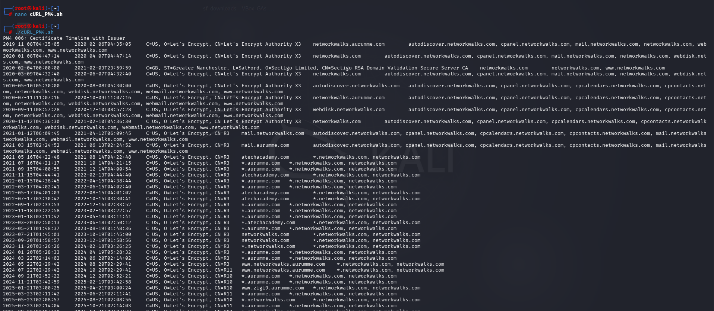

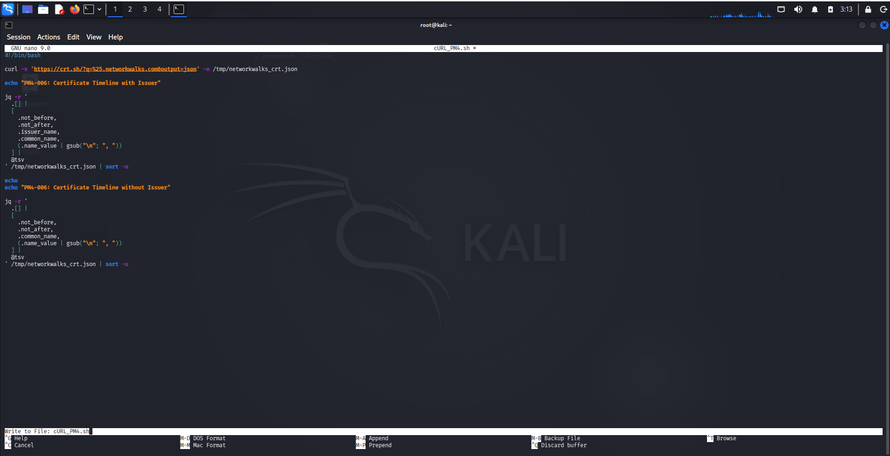

The direct crt.sh query produced a substantive certificate dataset.

The normalized certificate-derived inventory contained ten names:

``` text
networkwalks.com
*.networkwalks.com
www.networkwalks.com
mail.networkwalks.com
cpanel.networkwalks.com
webmail.networkwalks.com
webdisk.networkwalks.com
autodiscover.networkwalks.com
cpcontacts.networkwalks.com
cpcalendars.networkwalks.com
```

## Historical namespace

### 📸 Proof --- Historical Certificate Names


Historical certificates showed a recognizable service-oriented grouping:

``` text
Web
├── www.networkwalks.com
│
Mail
├── mail.networkwalks.com
└── autodiscover.networkwalks.com
│
Hosting / Control
├── cpanel.networkwalks.com
├── webdisk.networkwalks.com
├── webmail.networkwalks.com
├── cpcontacts.networkwalks.com
└── cpcalendars.networkwalks.com
```

Historical records are not automatically current exposure.

## Subfinder correlation

### 📸 Proof --- Subfinder Passive Discovery

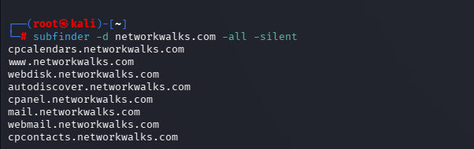

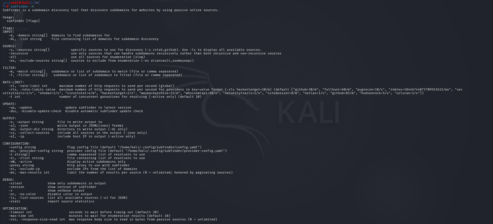

Subfinder independently returned eight of the CT-derived names.

``` text
Certificate Transparency
          │
          ├── 10 normalized names
          │
          ▼
       Intersection
          ▲
          │
          └── Subfinder
              8 matching names
```

This eight-name overlap is the strongest passive cross-source
correlation obtained in PM4.

## Cross-domain certificate observations

### 📸 Proof --- Passive-Recon Evidence Workspace

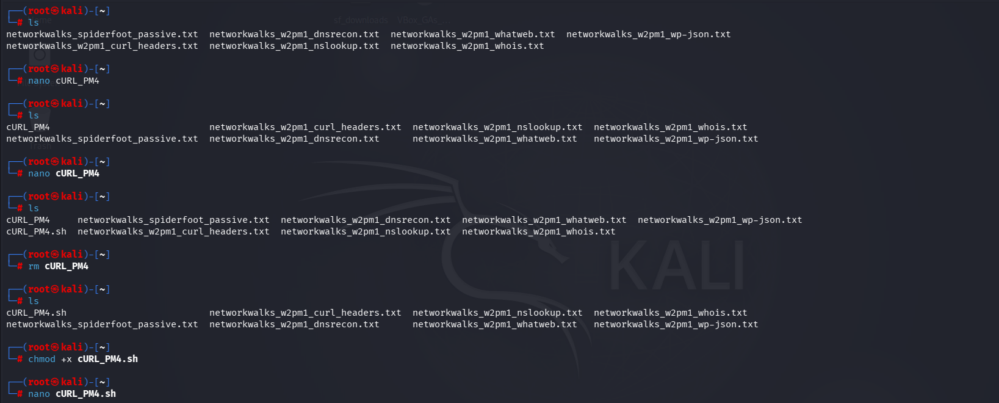

Historical certificate records also contained Common Name/name-set
combinations involving other domains.

The correct interpretation is:

``` text
Historical CT pattern
        ↓
Possible shared infrastructure /
certificate-management history /
migration / hosting relationship
        ↓
Requires independent validation
```

It is **not** treated as proof of:

-   certificate misissuance
-   takeover
-   compromise
-   ownership relationship
-   cross-tenant access

------------------------------------------------------------------------

# 5️⃣ W2-PM5 --- Network Scanning

## Objective

PM5 moved from passive reconnaissance into authorized network-level
enumeration.

### PM5 architecture

``` text
Target: 192.232.216.135
│
├── Nmap baseline
├── Interface / route discovery
├── Target resolution
├── Host discovery
├── TCP discovery
├── Service/version validation
├── NSE
├── HTTP/HTTPS
├── TLS
├── OS detection
└── Zenmap
     └── GUI correlation
```

## Nmap baseline

### 📸 Proof — Nmap Installation, Options & Interfaces

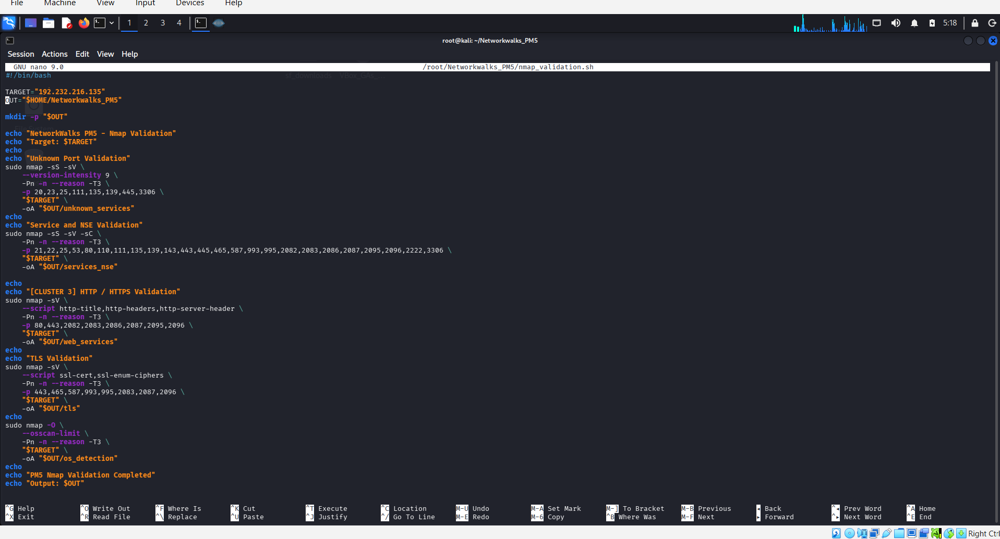

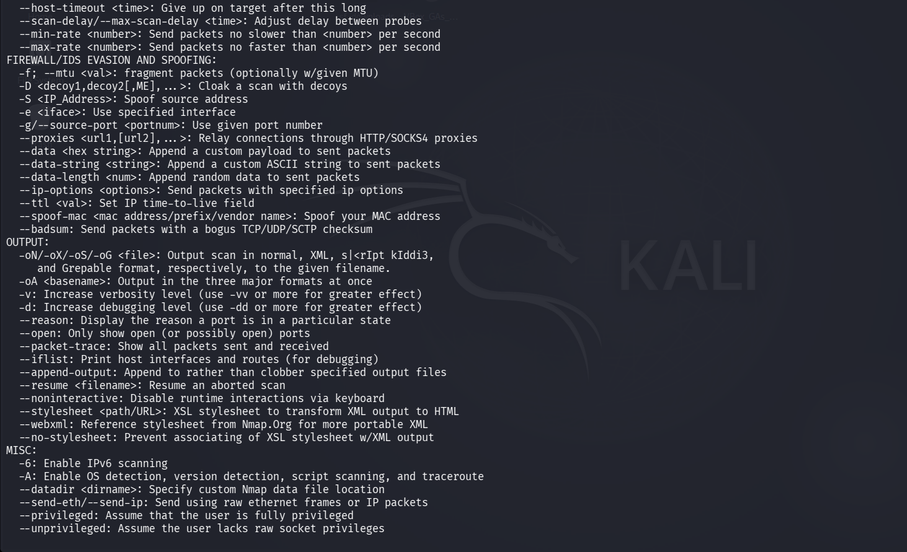

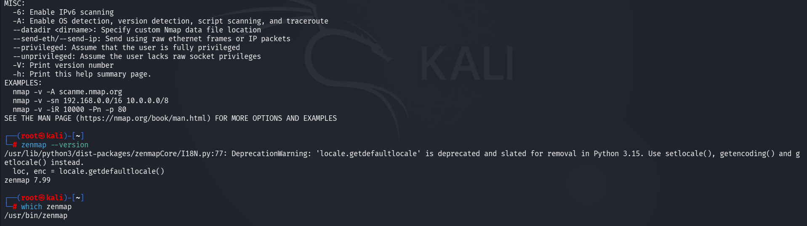

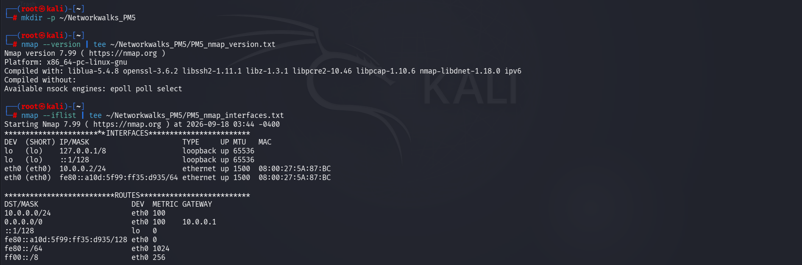

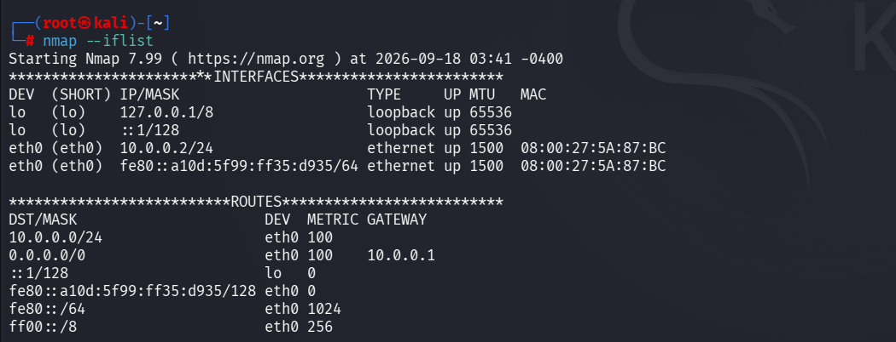

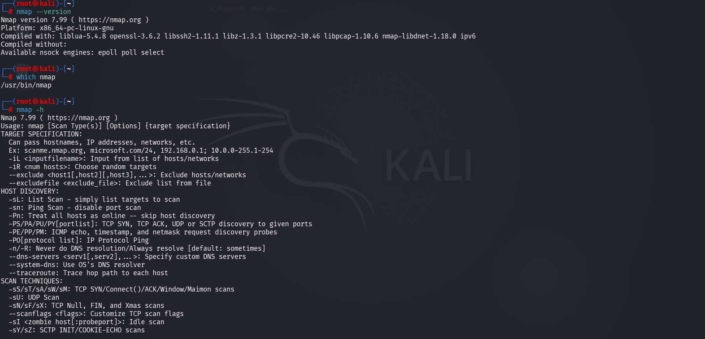


Observed:

``` text
Nmap 7.99
/usr/bin/nmap
```

Kali interface:

``` text
eth0
10.0.0.2/24
Gateway: 10.0.0.1
```

## Target resolution

### 📸 Proof — Nmap Target Resolution

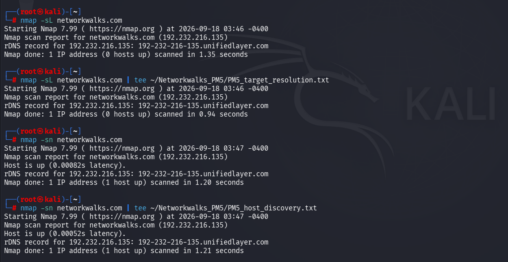


Nmap resolved:

``` text
networkwalks.com
       ↓
192.232.216.135
       ↓
192-232-216-135.unifiedlayer.com
```

## Host discovery

### 📸 Proof — Nmap Host Discovery


The host was reported as up during Nmap host discovery.

## Broad TCP scan

### 📸 Proof — Broad TCP Scanning & Port Extraction

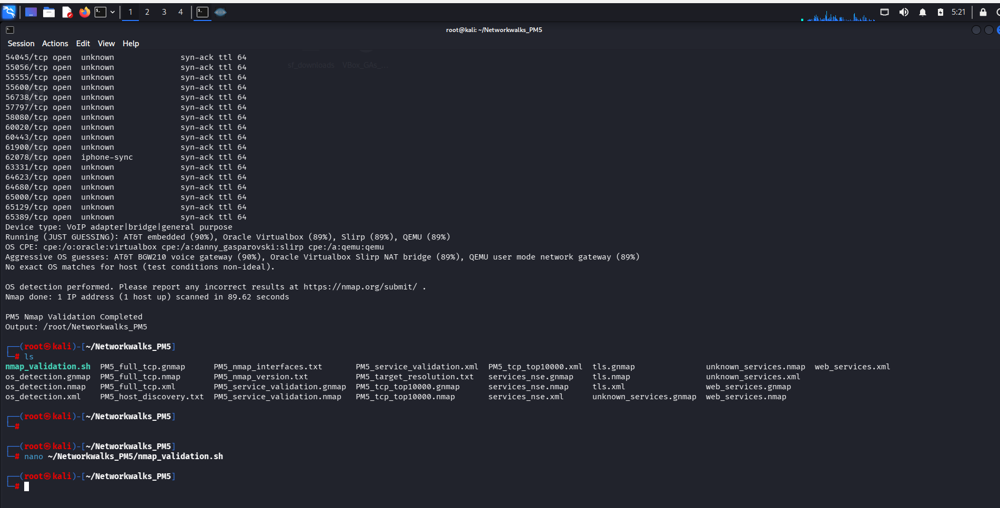

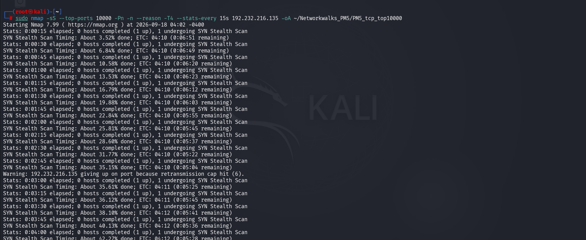

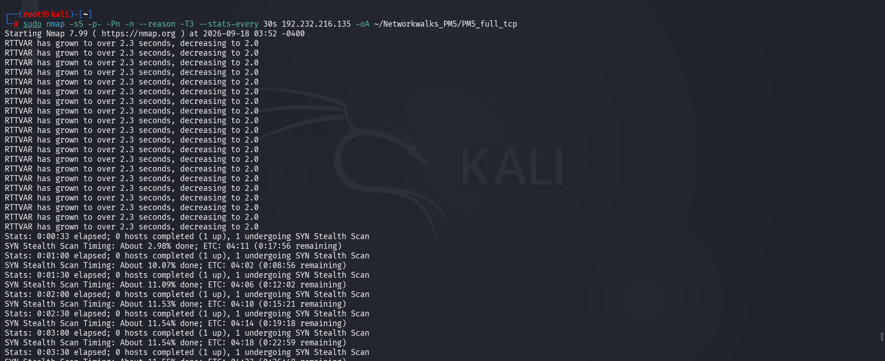

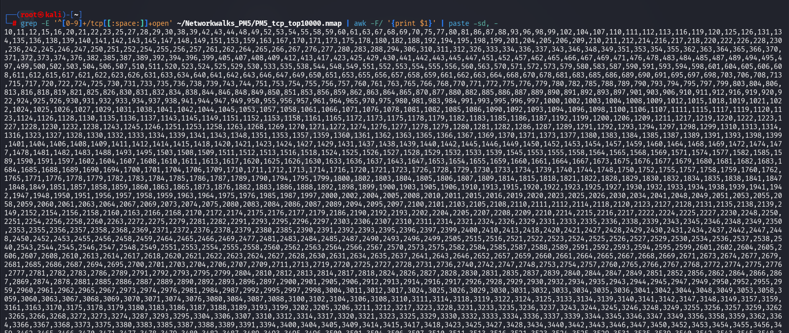


A staged top-10,000 TCP scan completed after approximately 10 minutes
and 45 seconds.

Observed:

``` text
3,410 reported open TCP states
4,977 filtered TCP ports
```

The scan also produced:

-   retransmission-cap warnings
-   substantial RTTVAR growth
-   variable probe timing
-   repeated `syn-ack ttl 64` response patterns

### Interpretation

The large number of reported open states is treated as a
**response-surface observation**, not as proof of thousands of
independent applications.

The stronger evidence comes from targeted service/version validation.

------------------------------------------------------------------------

# 6️⃣ PM5 --- Confirmed Service Identities

### 📸 Proof — Service Validation

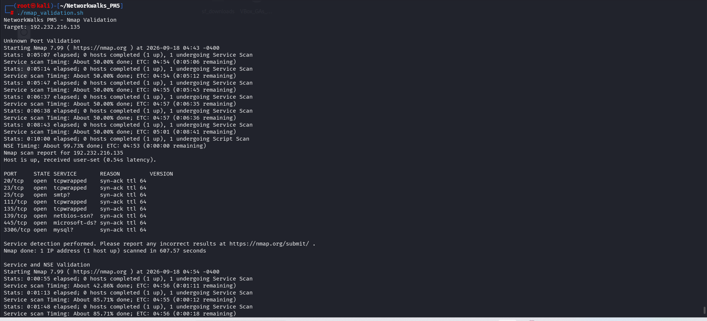

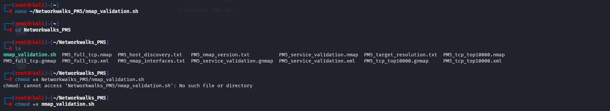

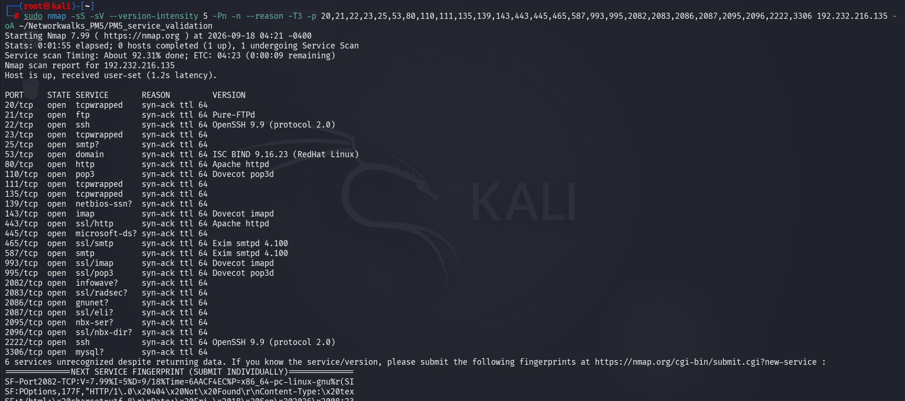

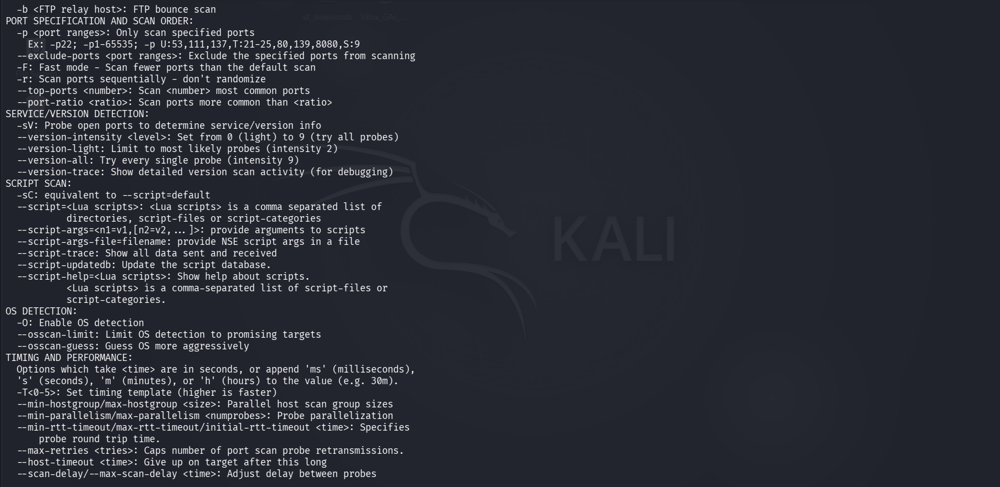


The targeted validation scan positively identified:

    Port Service / version
  ------ --------------------
      21 Pure-FTPd
      22 OpenSSH 9.9
      53 ISC BIND 9.16.23
      80 Apache HTTP Server
     110 Dovecot POP3
     143 Dovecot IMAP
     443 Apache HTTP Server
     465 Exim SMTP 4.100
     587 Exim SMTP 4.100
     993 Dovecot IMAPS
     995 Dovecot POP3S
    2222 OpenSSH 9.9

Additional ports remained candidates or unresolved:

``` text
20/tcp   tcpwrapped
23/tcp   tcpwrapped
25/tcp   smtp?
111/tcp  tcpwrapped
135/tcp  tcpwrapped
139/tcp  netbios-ssn?
445/tcp  microsoft-ds?
3306/tcp mysql?
```

These were not converted into vulnerability claims.

------------------------------------------------------------------------

# 7️⃣ PM5 --- Web / Hosting Management Surface

### 📸 Proof — Web / Hosting Validation


Targeted HTTP validation produced application fingerprints on:

``` text
2082
2083
2086
2087
2095
2096
```

The responses were consistent with cPanel/WHM/webmail-style hosting
interfaces.

``` text
2082 → cPanel-style HTTP
2083 → cPanel HTTPS
2086 → WHM/cPanel-style HTTP
2087 → WHM HTTPS
2095 → webmail-style HTTP
2096 → webmail HTTPS
```

Session-cookie names and HTTP responses provided additional
application-level evidence.

No authentication bypass was tested.

------------------------------------------------------------------------

# 8️⃣ PM5 --- Mail Services

### 📸 Proof — Mail Service Validation


Nmap service validation identified:

``` text
SMTP
├── 465
└── 587

POP3
├── 110
└── 995

IMAP
├── 143
└── 993
```

Exim and Dovecot were positively identified on the relevant ports.

NSE output exposed protocol capabilities including STARTTLS and
authentication mechanisms.

This establishes service exposure; it does not establish open relay,
credential weakness or account compromise.

------------------------------------------------------------------------

# 9️⃣ PM5 --- TLS

### 📸 Proof — TLS / Encrypted Service Validation


TLS inspection identified TLS 1.2 and TLS 1.3 support on several
encrypted endpoints.

Provider-associated certificate identity was observed on several
services:

``` text
Subject:
*.hostgator.com

SAN:
*.hostgator.com
hostgator.com

Key:
RSA 2048-bit
```

The provider identity is important attribution context because the
target appears to use shared hosting infrastructure.

It should not be interpreted as a Networkwalks-specific certificate
vulnerability.

------------------------------------------------------------------------

# 🔟 PM5 --- OS Detection

### 📸 Proof — OS Detection / Nmap Capability Evidence


Nmap OS detection returned broad guesses but explicitly stated:

``` text
No exact OS matches for host
(test conditions non-ideal)
```

The repository therefore records OS identification as **inconclusive**.

The guesses are retained as scanner output rather than being promoted to
a definitive operating-system claim.

------------------------------------------------------------------------

# 1️⃣1️⃣ Zenmap — Graphical Nmap Workflow

## Overview

Zenmap is the graphical interface for Nmap and provides a visual way to
configure scans, execute Nmap profiles, review host and port results,
inspect service information and correlate multiple scans. For this
assessment it provided a GUI-oriented view of the network enumeration
workflow already performed with Nmap CLI.

``` text
Target
  ↓
Zenmap profile selection
  ↓
Generated Nmap command
  ↓
Scan execution
  ↓
Nmap Output
  ├── Hosts
  ├── Ports / Hosts
  ├── Services
  ├── Host Details
  └── Topology
  ↓
Correlation with Nmap CLI evidence
```

## Zenmap environment

``` text
Zenmap 7.99
/usr/bin/zenmap
Target: 192.232.216.135
Profile: Intense scan
```

### 📸 Proof — Zenmap Configuration

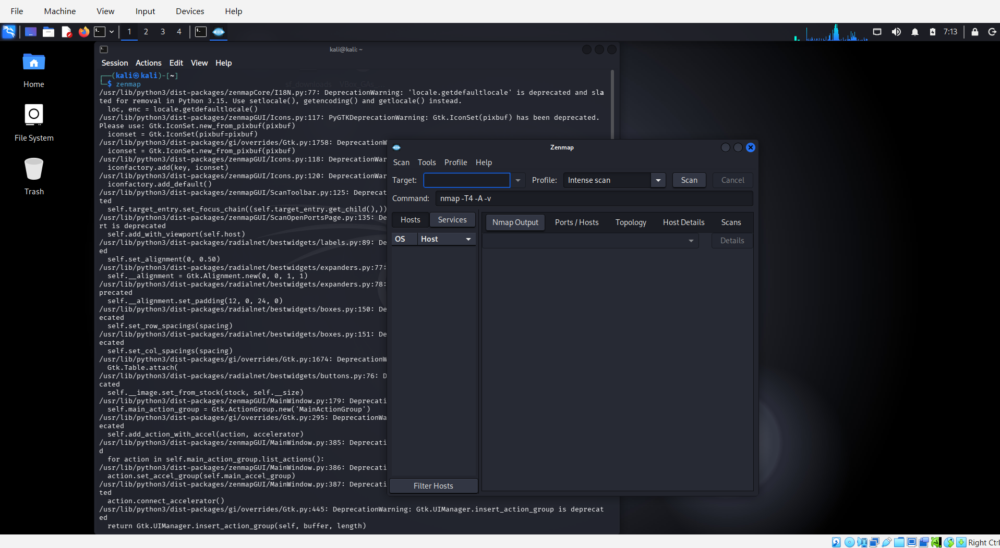

The Zenmap configuration view records the target, selected scan profile
and generated Nmap command. This provides GUI-level evidence of how the
scan was configured before execution.

### 📸 Proof — Zenmap Final Results

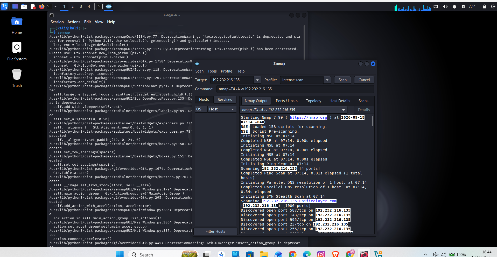

The completed Zenmap result view provides the graphical scan output used
for final correlation with the independently captured Nmap CLI results.
The relevant host, port and service information should be interpreted
against the validated Nmap service inventory rather than treating every
scanner state as a confirmed application.

## Zenmap and Nmap correlation

The GUI workflow and command-line workflow are two interfaces to the same
Nmap scanning engine. The assessment therefore uses Zenmap to present and
review the scan while retaining the CLI outputs as the detailed raw
evidence source.

``` text
Zenmap GUI
    │
    ├── Target / Profile
    ├── Generated command
    └── Visual result views
             │
             ▼
       Nmap scan engine
             │
             ▼
      CLI raw evidence
             │
             ▼
       Service validation
```

## What Zenmap contributed

- Visual scan configuration and profile selection.
- Immediate access to Nmap output without relying only on terminal logs.
- Host, port and service-oriented result views.
- A convenient interface for reviewing scan history and comparing scans.
- A graphical representation of network relationships where topology data
  is available.
- A clear bridge between practical GUI-based training and reproducible
  Nmap command-line assessment.

# 🔗 Cross-PM Correlation

The most useful result from Week 2 is the relationship between
independent observations.

``` text
PM1
│
├── networkwalks.com
├── 192.232.216.135
├── HostGator DNS
├── Apache / WordPress
└── ModSecurity
       │
       ▼
PM4
│
├── Certificate-derived names
├── Historical service namespace
└── 8-name CT/Subfinder intersection
       │
       ▼
PM5
│
├── Apache
├── OpenSSH
├── Pure-FTPd
├── BIND
├── Exim
├── Dovecot
└── cPanel / WHM / webmail
       │
       ▼
External attack-surface model
```

This is more useful than any single tool output because independent
observations reinforce the infrastructure model.

------------------------------------------------------------------------

# 🧠 Evidence Classification

Every Week 2 observation should be interpreted using the following
model:

``` text
OBSERVED
   ↓
REPRODUCED / CORRELATED
   ↓
VALIDATED
   ↓
ATTRIBUTED
   ↓
SECURITY IMPACT
   ↓
FINDING
```

Not every observation reaches the final stage.

For example:

``` text
Nmap says 3306 open
        ↓
Service fingerprint = mysql?
        ↓
Not positively validated
        ↓
Candidate only
```

Whereas:

``` text
21/tcp open
        ↓
-sV identifies Pure-FTPd
        ↓
Protocol response supports FTP
        ↓
Confirmed exposed service
```

------------------------------------------------------------------------

# 🚫 Week 2 Non-Findings

The current evidence does **not** establish:

-   Authentication bypass
-   Credential compromise
-   Anonymous FTP access
-   SMTP open relay
-   DNS zone transfer
-   DNS open recursion
-   SSH authentication weakness
-   cPanel authentication bypass
-   WHM authentication bypass
-   MySQL authentication weakness
-   Confirmed CVE exploitation
-   Domain takeover
-   Certificate misissuance
-   Cross-tenant compromise
-   Unauthorized access

These are intentionally recorded as non-findings or untested areas
rather than being inferred from reconnaissance output.

------------------------------------------------------------------------

# 🧪 Reproducibility --- PM1

``` bash
whois networkwalks.com

nslookup networkwalks.com 8.8.8.8
nslookup -type=NS networkwalks.com 8.8.8.8
nslookup -type=MX networkwalks.com 8.8.8.8
nslookup -type=TXT networkwalks.com 8.8.8.8
nslookup -type=SOA networkwalks.com 8.8.8.8

dig @ns6135.hostgator.com networkwalks.com A
dig @ns6135.hostgator.com networkwalks.com SOA

whatweb https://networkwalks.com
curl -I https://networkwalks.com
wafw00f https://networkwalks.com
```

------------------------------------------------------------------------

# 🧪 Reproducibility --- PM4

``` bash
theHarvester --version
theHarvester -h

theHarvester -d networkwalks.com -b certspotter -l 100
theHarvester -d networkwalks.com -b crtsh -l 100

curl -s 'https://crt.sh/?q=%25.networkwalks.com&output=json' | jq .

curl -s 'https://crt.sh/?q=%25.networkwalks.com&output=json' |
jq -r '.[].name_value' |
sort -u

subfinder -version
subfinder -h
subfinder -d networkwalks.com -all -silent
```

------------------------------------------------------------------------

# 🧪 Reproducibility --- PM5

``` bash
nmap --version
which nmap
nmap --iflist

nmap -sL networkwalks.com
nmap -sn networkwalks.com

sudo nmap -sS --top-ports 10000 -Pn -n --reason -T4   192.232.216.135   -oA ~/Networkwalks_PM5/PM5_tcp_top10000

sudo nmap -sS -sV --version-intensity 5 -Pn -n --reason -T3   -p 20,21,22,23,25,53,80,110,111,135,139,143,443,445,465,587,993,995,2082,2083,2086,2087,2095,2096,2222,3306   192.232.216.135   -oA ~/Networkwalks_PM5/PM5_service_validation

sudo nmap -O --osscan-limit -Pn -n --reason -T3   192.232.216.135   -oA ~/Networkwalks_PM5/os_detection

zenmap --version
which zenmap
zenmap
```

------------------------------------------------------------------------

# 📁 Evidence Organization

``` text
Week-02-Networkwalks/
│
├── README.md
│
├── evidence/
│   ├── 01.png
│   ├── 02.png
│   ├── ...
│   ├── 51.png
    ├── 52.png
    └── 53.png
│
├── raw/
│   ├── os_detection.nmap
│   ├── PM5_service_validation.nmap
│   ├── PM5_tcp_top10000.nmap
│   ├── services_nse.nmap
│   ├── tls.nmap
│   ├── unknown_services.nmap
│   └── web_services.nmap
│
└── source-material/
    ├── W2-PM1-source-evidence.zip
    ├── W2-PM2-LAB-PRACTICE.pdf
    ├── W2-PM4-source-evidence.zip
    └── W2-PM5-Nmap-Zenmap-source-evidence.zip
```

------------------------------------------------------------------------


### 📸 Additional Supplied Evidence

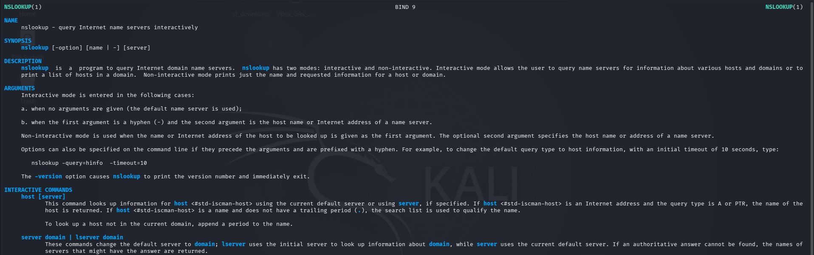

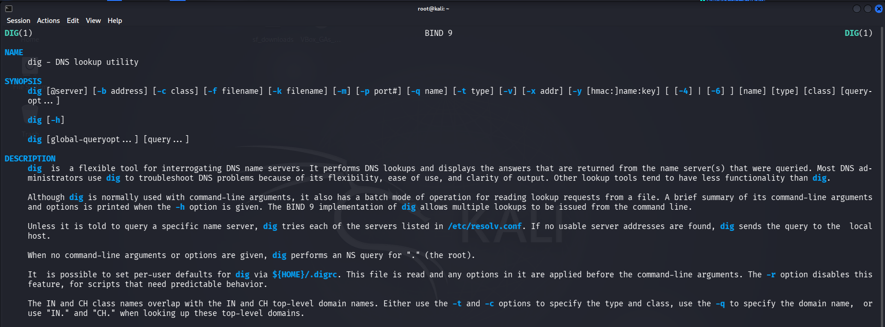

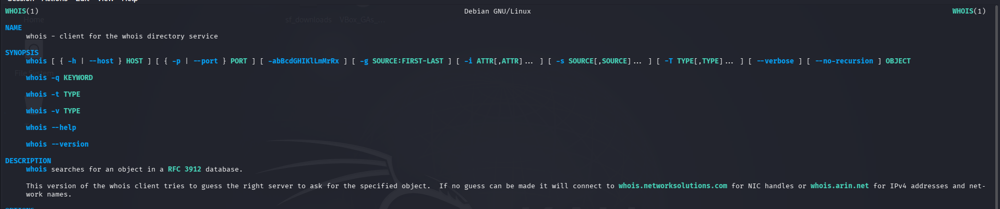

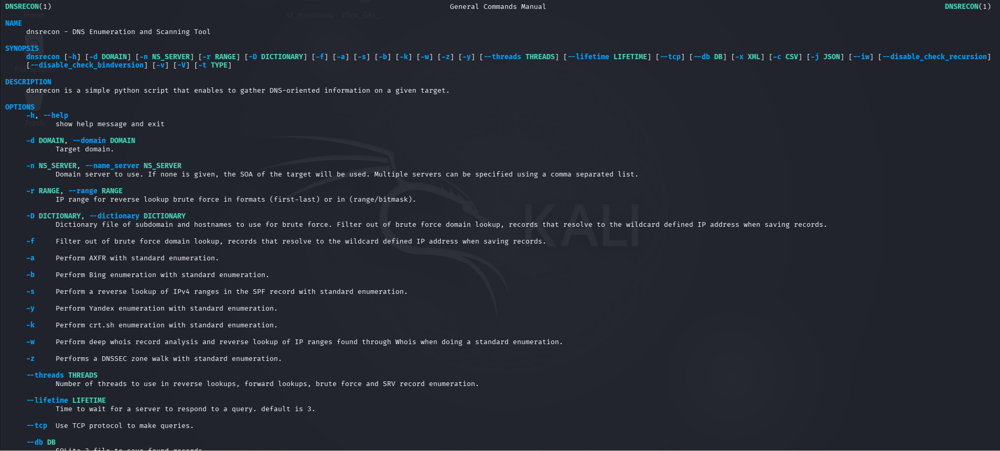

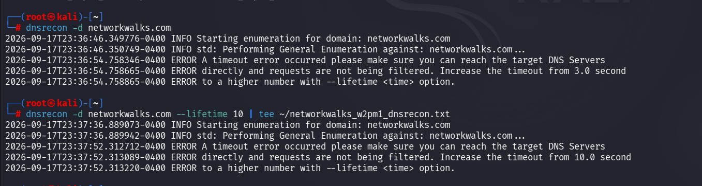

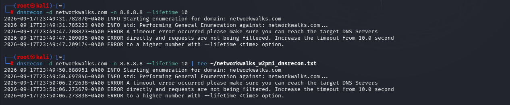

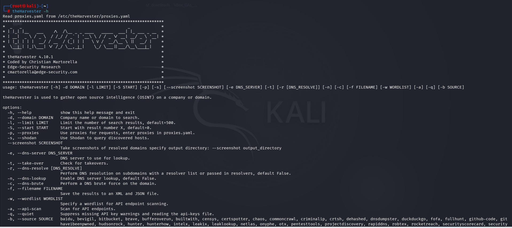


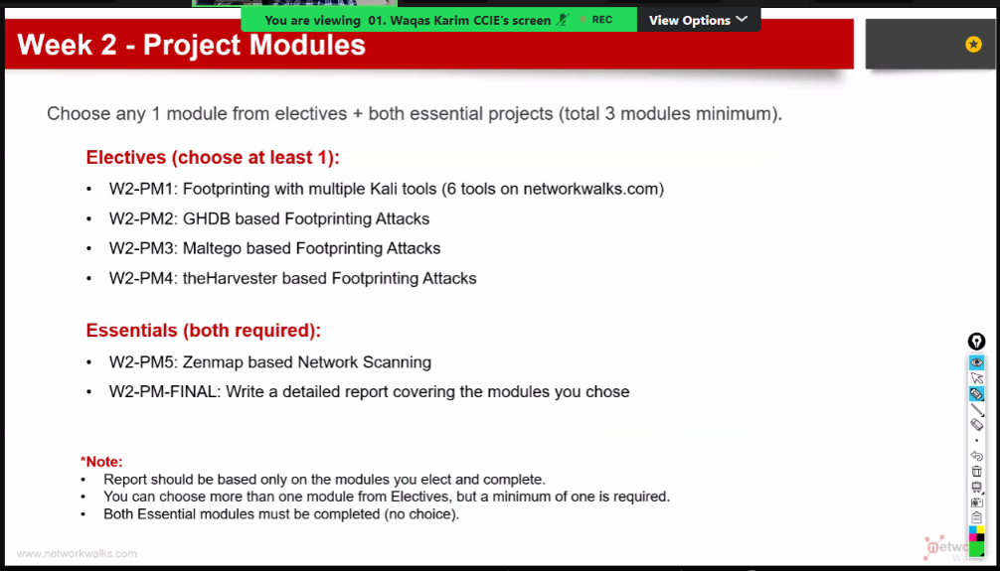


# 🧾 Screenshot-to-Task Proof Index

Every supplied screenshot is embedded directly under the relevant
activity above. The repository therefore keeps the evidence next to the
claim it supports instead of placing all screenshots in a disconnected
gallery.

  ------------------------------------------------------------------------
                      Evidence Area                  Purpose
  ---------------------------- --------------------- ---------------------
                        01--18 PM1                   DNS, WHOIS, WhatWeb,
                                                     cURL, WAFW00F,
                                                     DNSRecon, SpiderFoot
                                                     output preservation and
                                                     validation

                        19--27 PM4                   theHarvester, CT,
                                                     crt.sh, historical
                                                     certificates and
                                                     passive workspace

                        28--42 PM5                   Nmap scripting,
                                                     options, interfaces,
                                                     discovery, TCP
                                                     scanning and services

                            43 PM1                   Additional DNSRecon
                                                     evidence

                            44 Week 2                Supplied
                                                     module/assignment
                                                     structure

                            45 PM1                   Additional
                                                     HTTP-header evidence

                            46 PM4                   Subfinder passive
                                                     discovery

                            47 PM1                   Additional WHOIS
                                                     evidence

                            48 PM4                   Subfinder/tool
                                                     baseline

                            49 PM5 / Zenmap          Zenmap GUI configuration
                                                     evidence

                            50 PM1                   Additional DNSRecon
                                                     evidence

                            51 PM4                   Subfinder methodology
                                                     evidence

                            52 PM5 / Zenmap          Completed Zenmap
                                                     configuration / scan
                                                     evidence

                            53 PM5 / Zenmap          Completed Zenmap
                                                     result / correlation
                                                     evidence
  ------------------------------------------------------------------------

> **Proof rule:** a screenshot proves only what is visibly shown in that
> capture. It does not automatically prove ownership, exploitability,
> current liveness, or vulnerability severity.

# 📦 Source Archives

The original PM evidence archives used to assemble this README are
retained under `source-material/`.

-   `W2-PM1-source-evidence.zip` --- original PM1 screenshots and
    supplied PM1 material.
-   `W2-PM2-LAB-PRACTICE.pdf` --- supplied PM2 training/module brief.
-   `W2-PM4-source-evidence.zip` --- original PM4 screenshots.
-   `W2-PM5-Nmap-Zenmap-source-evidence.zip` --- original Nmap/Zenmap
    evidence archive.

The raw Nmap outputs supplied later are retained under `raw/`.

------------------------------------------------------------------------

# 📊 Week 2 Completion Status

  -----------------------------------------------------------------------
  Module                  Current status          Evidence position
  ----------------------- ----------------------- -----------------------
  W2-PM1                  ✅ Completed            Detailed execution
                                                  evidence

  W2-PM2                  📚 Module documented    Supplied training
                                                  material preserved; no
                                                  invented execution
                                                  results

  W2-PM3                  ⏳ Reserved             No completed Maltego
                                                  execution evidence
                                                  claimed

  W2-PM4                  ✅ Completed            CT + Subfinder passive
                                                  reconnaissance

  W2-PM5 Nmap             ✅ Completed            Discovery, service,
                                                  NSE, web, TLS and OS
                                                  evidence

  W2-PMB Zenmap           ✅ Completed            GUI scan workflow,
                                                  configuration and final
                                                  result evidence

  W2-PM-FINAL             ✅ Consolidated          README provides the
                                                  consolidated Week 2 structure
  -----------------------------------------------------------------------

------------------------------------------------------------------------

# 🧩 Practical Skills Demonstrated

``` text
Reconnaissance
├── WHOIS
├── DNS enumeration
├── Authoritative DNS validation
├── Web fingerprinting
└── WAF fingerprinting

Passive Intelligence
├── theHarvester
├── Certificate Transparency
├── crt.sh
├── CertSpotter
└── Subfinder

Network Enumeration
├── Nmap
├── TCP SYN scanning
├── Service/version detection
├── NSE
├── HTTP/HTTPS analysis
├── TLS inspection
└── OS fingerprinting

Analysis
├── Cross-source correlation
├── Current vs historical distinction
├── Shared-infrastructure attribution
├── Candidate vs confirmed service classification
└── Evidence-based reporting
```

------------------------------------------------------------------------

# 🧠 Key Lessons from Week 2

### 1. A failed tool does not necessarily mean a failed target

DNSRecon timed out, but direct authoritative DNS queries succeeded.

### 2. A port is not automatically a service

Broad scanning generated an unusually large open-port response surface.
Targeted `-sV` validation provided much stronger evidence about actual
protocols and applications.

### 3. Passive data needs temporal context

Certificate Transparency records can describe historical infrastructure
that is no longer active.

### 4. Shared hosting changes attribution

Provider-associated services and certificates should not automatically
be treated as assets uniquely owned or operated by the target.

### 5. Tool output is evidence, not a conclusion

The strongest workflow is:

``` text
Tool output
    ↓
Independent validation
    ↓
Correlation
    ↓
Attribution
    ↓
Security interpretation
```

------------------------------------------------------------------------

# 🏁 Week 2 Assessment Flow

``` text
WEEK 1
Controlled Virtual Lab
        │
        ▼
W2-PM1
External Footprinting
        │
        ▼
W2-PM2
GHDB Search Intelligence
        │
        ▼
W2-PM3
Maltego Relationship Analysis
        │
        ▼
W2-PM4
Passive Certificate Intelligence
        │
        ▼
W2-PM5
Nmap Network Enumeration
        │
        ▼
W2-PMB
Zenmap GUI Validation
        │
        ▼
Cross-PM Correlation
        │
        ▼
Validated Findings
        │
        ▼
W2-PM-FINAL
Professional Security Report
```

------------------------------------------------------------------------

# 🔐 Responsible Security Practice

The objective of the project is to develop the ability to move from raw
technical output to defensible security conclusions.

A mature assessment does not maximize the number of findings. It
maximizes the quality of the evidence supporting each conclusion.

``` text
Authorization
      +
Scope
      +
Technical Evidence
      +
Independent Validation
      +
Clear Attribution
      +
Reproducibility
      =
Professional Security Assessment
```

------------------------------------------------------------------------

<div align="center">

### 🔐 Week 2 — Networkwalks Cybersecurity Assessment

**External Reconnaissance • Passive Intelligence • Network Scanning • Evidence-Based Analysis**

</div>
